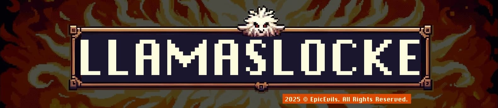

# 🔥 **LlamasLocke** – Random‑Locke MAX for a **Game Fire Red** / **Game Leaf Green**

_LlamasLocke_ turbo‑charges the classic Nuz‑style challenge for **Game Fire Red** and **Game Leaf Green**.  
You get **999 key items**, a dynamic level‑cap, shiny & legendary parity, instant‑escape protection, mandatory dupes, flexible evolutions, multi‑floor consolidation, a “vegetable” clause to skip useless cocoons, friendly‑battle exhibitions, **10‑heart lives per region**, and even **multi‑region transfers**. Built for **fully‑randomized ROMs** where every sprite, type and move can change.

---

## 🗺️ Quick Overview
| 🎯 Goal | Defeat the League while honoring every rule.                  |
| ------ | ------------------------------------------------------------- |
| 💀 Loss | Party wipe **_or_** no usable Wild encounters left in the PC. |
| 🏆 Win  | Beat the Champion under the level‑cap & rules.                |

---

## ❤️ Regional Heart Pool
Each region starts with **10 Hearts**.  
* If a Wild encounter faints, remove **1 Heart**.  
* At **0 Hearts**, the run for that region ends (even if surviving Wild encounters remain).

---

## 🚚 Multi‑Region Transport
After clearing a region’s League, you may **transfer up to 6 surviving Wild encounters** (your choice) to the next game/region. They keep their levels, moves, items, and shiny status—but must still obey the new region’s level‑cap.

---

## 🧰 Starting Load‑out
| Item                     | Qty.    | Why                                          |
| ------------------------ | ------- | -------------------------------------------- |
| All Poké Balls           | 999 ea. | Needed for the capture chain.                |
| Rare Candy               | 999     | Level tuning up to the cap. [^RC]            |
| Max Repel                | 999     | Skip low‑level/duplicate mobs. [^Repel]      |
| Full Heal / Full Restore | 999     | Infinite recovery; difficulty is rule‑based. |

---

## 🚦 Dynamic Level‑Cap
| Segment  | Buffer    |
| -------- | --------- |
| Gyms 1‑3 | **+5 Lv** |
| Gyms 4‑6 | **+3 Lv** |
| Gym 7    | **+2 Lv** |
| Gym 8    | **+1 Lv** |
| Elite 4  | **+2 Lv** |
| Champion | **+1 Lv** |

> **Rare Candy** may never push a Wild encounter past these limits. [^Gyms]

---

## 🎯 Capture Flow

1. **OHKO Check** → If your lead can one‑shot, skip attacking.  
2. **Ball Sequence**  
   1. 5 Poké Balls (×1). [^Catch]  
   2. 3 Great Balls (×1.5). [^GB]  
   3. 2 Ultra Balls (×2). [^UB]  
   4. 1 Master Ball (100 %). [^MB]

+++mermaid
flowchart TD
    A[Wild Encounter] --> B{OHKO Risk?}
    B -- Yes --> D[Ball Sequence]
    B -- No --> C[Chip HP / Status]
    C --> D
    D --> E[5 Poké Balls]
    E -- Fail --> F[3 Great Balls]
    F -- Fail --> G[2 Ultra Balls]
    G -- Fail --> H[Master Ball]
+++

**Escape Clause** → Teleport, Roar, Whirlwind or roaming beasts → **Master Ball instantly**. [^Teleport] [^Roar] [^Whirlwind]

---

## 🌍 Area & Encounter Rules

| #   | Rule                          | Essence / Rationale                                                                                                                  |
| --- | ----------------------------- | ------------------------------------------------------------------------------------------------------------------------------------ |
| 1   | **First‑Encounter**           | Only the first Wild encounter per area counts. [^Nuz]                                                                                |
| 2   | **Permadeath**                | Faint = dead (box/release) **and** loses 1 Heart.                                                                                    |
| 3   | **Nicknames**                 | Mandatory—boosts emotional stakes.                                                                                                   |
| 4   | **Mandatory Dupes**           | Skip owned lines (alive or dead) until a new species appears, then catch. [^Dupes]                                                   |
| 5   | **Evolution Choice**          | First valid encounter is an evolved form from a new line? Catch **or** skip and keep searching. [^Evo]                               |
| 6   | **Shiny Clause**              | Old route → free shiny; new route → unlimited shinies but only **one non‑shiny**. [^Shiny]                                           |
| 7   | **Multi‑Floor Consolidation** | One catch per floor; empty floor grants **one bonus catch** on a prior floor. Release all but **one** capture from that entire area. |
| 8   | **Legendary Parity**          | If trainers get legends, you may use captured legends (subject to rules).                                                            |
| 9   | **Vegetable Clause**          | Kakuna, Metapod, Cascoon, Silcoon, etc. can’t be first encounters—skip them. [^Veg]                                                  |
| 10  | **Friendly Trainer Clause**   | Optional battles with previously skipped trainers are exhibitions—faints don’t cost Hearts or lives.                                 |
| 11  | **Capture Chain**             | 5 Poké → 3 Great → 2 Ultra → 1 Master.                                                                                               |
| 12  | **Flee Clause**               | Teleport/Roar/Whirlwind/roamer → Master Ball.                                                                                        |
| 13  | **Infinite Items**            | 999 Balls, Candies, Repels, Restores.                                                                                                |
| 14  | **Rare Candy Use**            | Only to cap or revive the run.                                                                                                       |
| 15  | **Max Repel Tactic**          | Steer to legal encounters without grinding.                                                                                          |
| 16  | **Trade‑Evo Patch**           | Universal Randomizer: all trade evolutions are level/stone. [^Randomizer]                                                            |

---

## 📑 Rule Quick Reference
| ID  | Name                  | Summary                                        |
| --- | --------------------- | ---------------------------------------------- |
| 1   | First‑Encounter       | 1 catch / area                                 |
| 2   | Permadeath + Heart    | Faint = RIP & –1 Heart                         |
| 3   | Nicknames             | Mandatory                                      |
| 4   | Dupes                 | Skip repeats                                   |
| 5   | Evolution Choice      | Accept/skip evolved first‑mons                 |
| 6   | Shiny Clause          | Extra shinies ok                               |
| 7   | Multi‑Floor           | 1 per floor, release extras                    |
| 8   | Legendary Parity      | Legends allowed                                |
| 9   | Vegetable Clause      | Skip cocoons                                   |
| 10  | Friendly Trainer      | Exhibition fights                              |
| 11  | Capture Chain         | 5‑3‑2‑1 balls                                  |
| 12  | Escape Clause         | Instant Master Ball                            |
| 13  | Level‑Cap             | +5/+3/+2/+1 & E4 +2, Champ +1                  |
| 14  | Infinite Items        | 999 everything                                 |
| 15  | Rare Candy Cap        | Never exceed cap                               |
| 16  | Max Repel Use         | Avoid dupes/XP                                 |
| 17  | Trade‑Evo Patch       | Level/stone evolves                            |
| 18  | 10‑Heart Pool         | Region ends at 0 Hearts                        |
| 19  | Multi‑Region Transfer | Move up to 6 surviving Wild encounters forward |

---

## 🏁 Good Luck, Trainer!
Expect crits, shinies, trolls, legends, cocoon bait and heart‑pounding wipes. Play smart, cherish your team, and may the Llamas be with you!

---

### 📚 References  
[^Nuz]: “Nuzlocke Challenge – Basic Rules,” *Bulbapedia*  
[^Dupes]: “Species/Dupes Clause,” *Nuzlocke Fandom*  
[^Evo]: Evolution clause threads, *r/nuzlocke*  
[^Shiny]: Community shiny clause consensus, *Smogon / Bulbapedia*  
[^Veg]: Kakuna / Metapod data—no reliable attacks, *Bulbapedia*  
[^Gyms]: Gym ace levels, *Serebii*  
[^Catch]: Catch‑rate formula Gen III, *Bulbapedia*  
[^GB]: Great Ball 1.5×, *Bulbapedia*  
[^UB]: Ultra Ball 2×, *Bulbapedia*  
[^MB]: Master Ball 100 %, *The Wiki*  
[^Teleport]: Teleport ends battles, *Bulbapedia*  
[^Roar]: Roar ends battles, *Bulbapedia*  
[^Whirlwind]: Whirlwind ends battles, *Bulbapedia*  
[^RC]: Rare Candy Gen III, *Bulbapedia*  
[^Repel]: Max Repel Gen III, *Bulbapedia*  
[^Randomizer]: Universal Game Randomizer – trade‑evo patch, *GitHub*